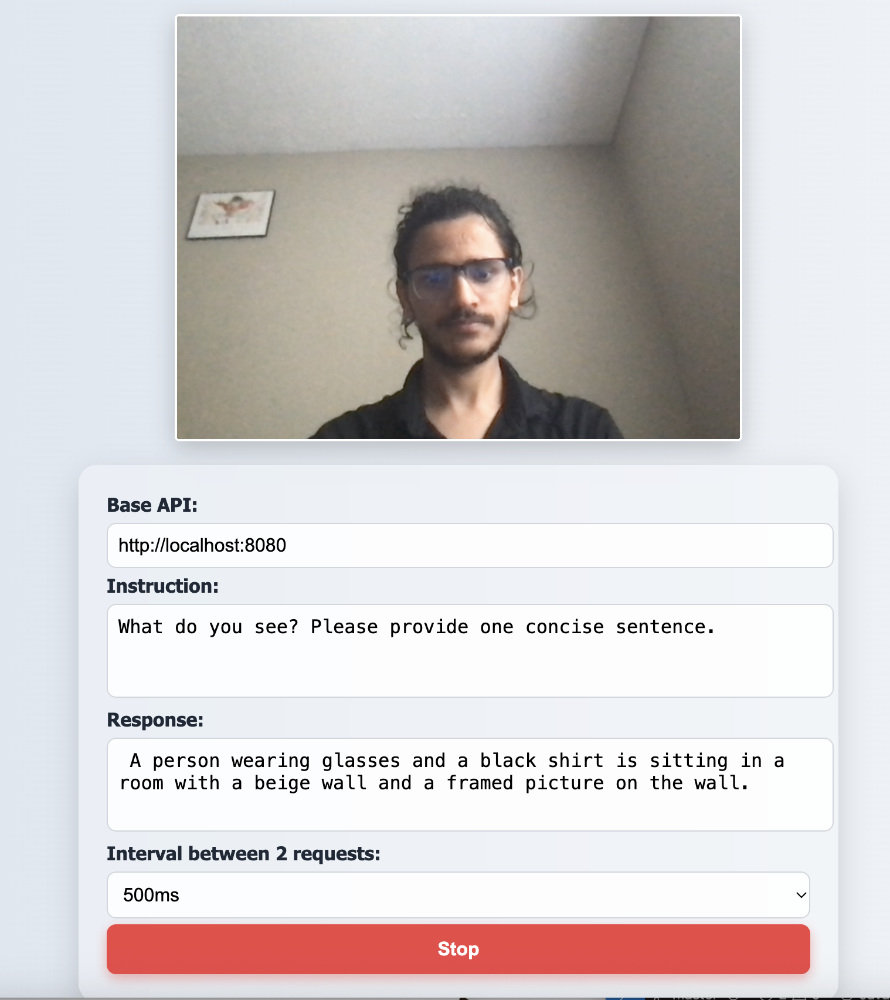

# 🖼️ SmolVLM Real-Time Webcam with Vision Instructions

This repository is a simple demo that uses a local **LLaMA.cpp** server with the **SmolVLM2-256M** vision-language model to detect and describe objects from your webcam in real time.

---

## 📷 Demo Preview

 

---

## ⚙️ How to Setup

1. **Install [llama.cpp](https://github.com/ggerganov/llama.cpp)**

2. **Build with vision support:**

   If you're using macOS or had issues with `build`:

   ```bash
   rm -rf build
   mkdir build && cd build
   cmake .. -DLLAMA_VISION=on -DGGML_METAL=OFF
   cmake --build . --config Release
Run the model server locally:

```bash
./bin/llama-server \
  -hf ggml-org/SmolVLM2-256M-Video-Instruct-GGUF \
  --no-mmproj-offload \
  -c 512 \
  --host 127.0.0.1 --port 8080
```

💡 This starts a local server with the SmolVLM2 256M model and enables webcam vision mode.

Open index.html in your browser.

Customize the instruction input to change the prompt sent to the model.

Click "Start" to see real-time object detection and vision-language responses.
